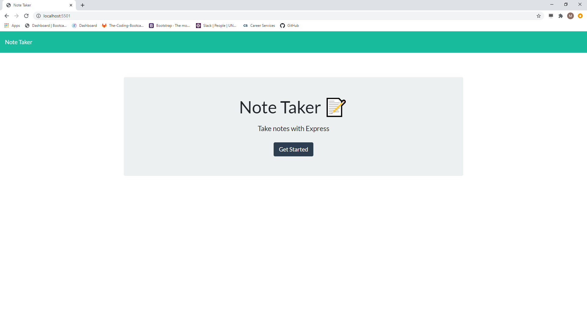
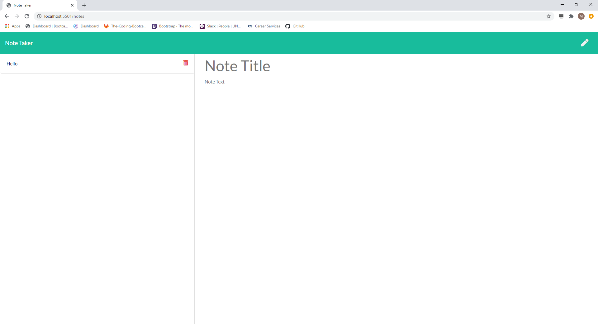
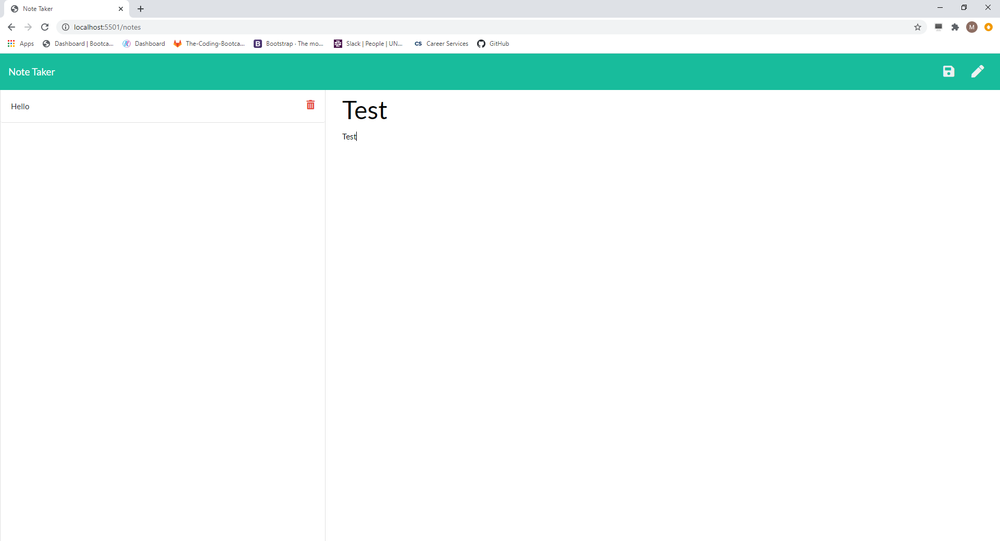
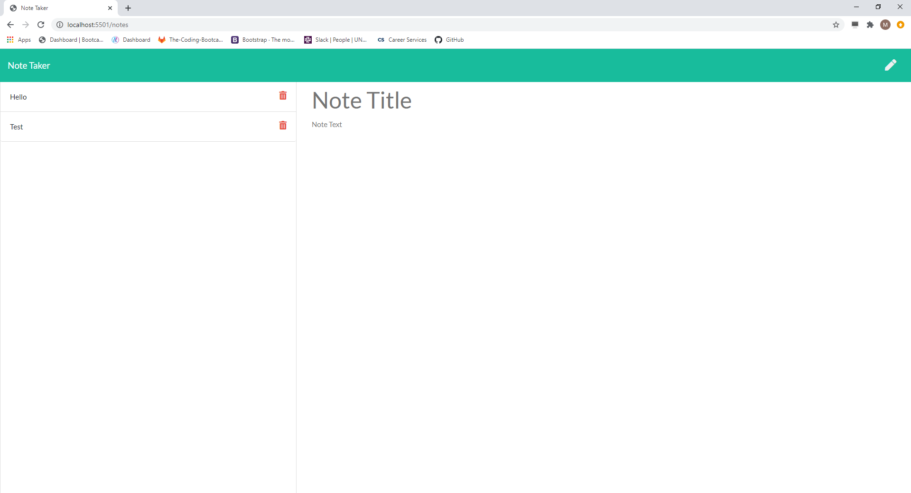

# note-taker #   note-taker
 # note-taker

 note-taker is an app that allows a user to recore and store notes
 
 ## Table of Contents
 * [Installation](#Installation)
 * [Usage](#Usage)
 * [License](#License)
 * [Contributing](#Contributing)
 * [Tests](#Tests)
 * [Questions](#Questions)
 
 
 ## Installation
 
 > node is required
 
 
 ## Usage
 
 > none
 
 
 ## License
 [MIT]  This project is covered by the MIT license
 
 ## Contributing
 none
 
 ## Tests
 none

 ## Questions
 for any questions visit my GitHub [sharkattack182](https://github.com/sharkattack182).
 or email me at matthewdc182@gmail.com.

 ## Example

  
   
  
    
  
   
  

 